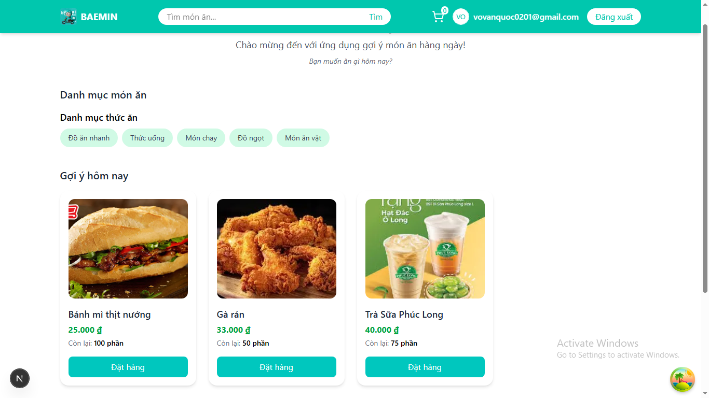
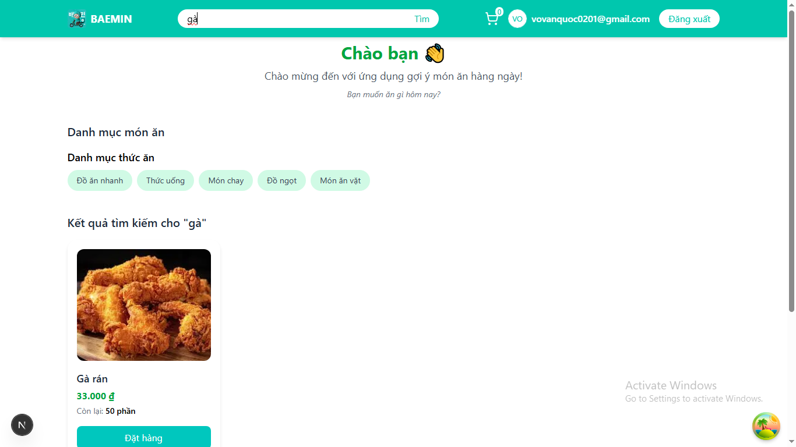
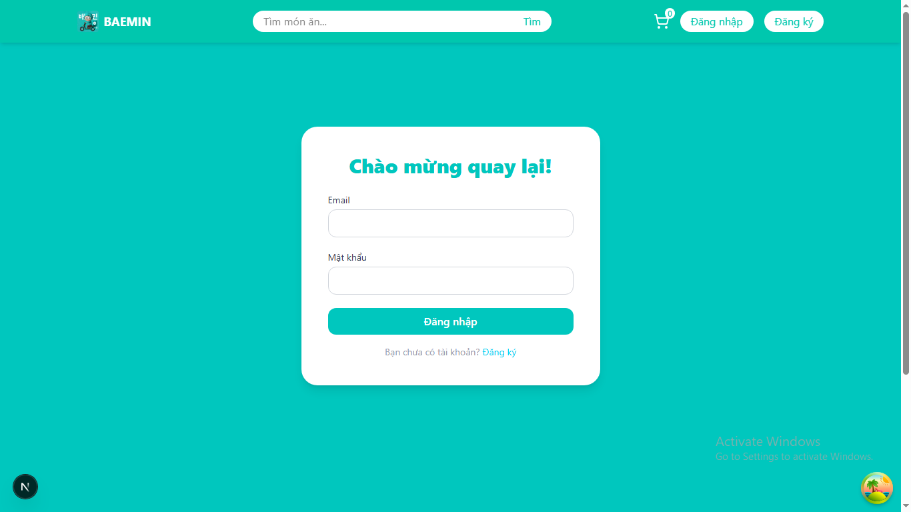
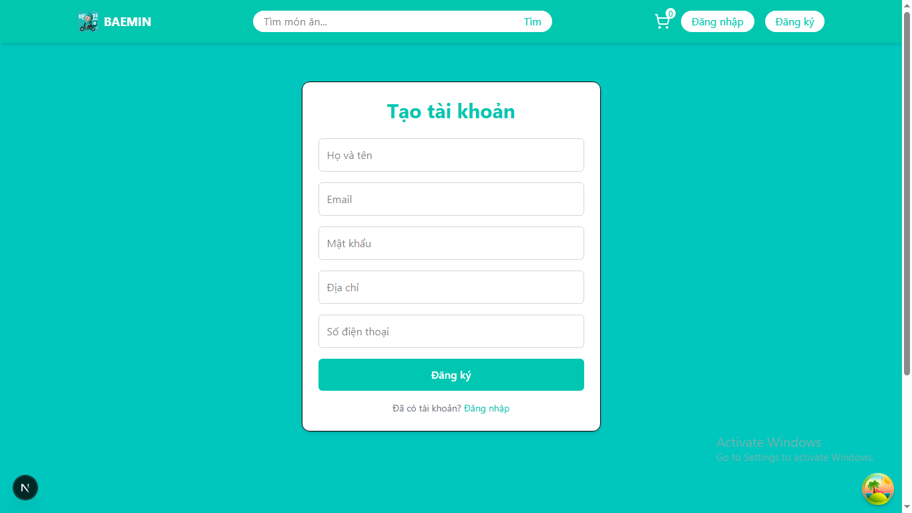
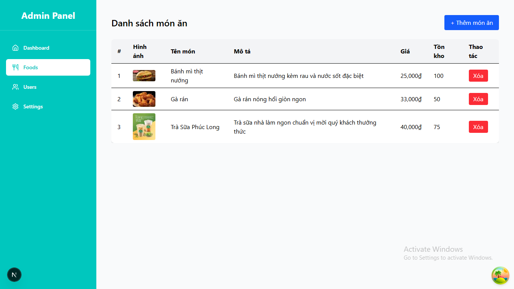
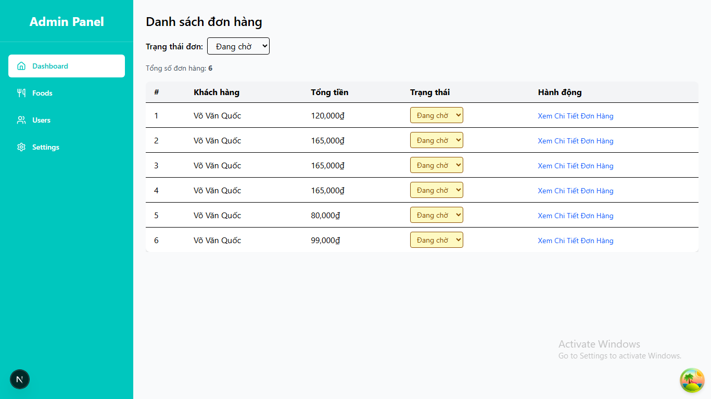
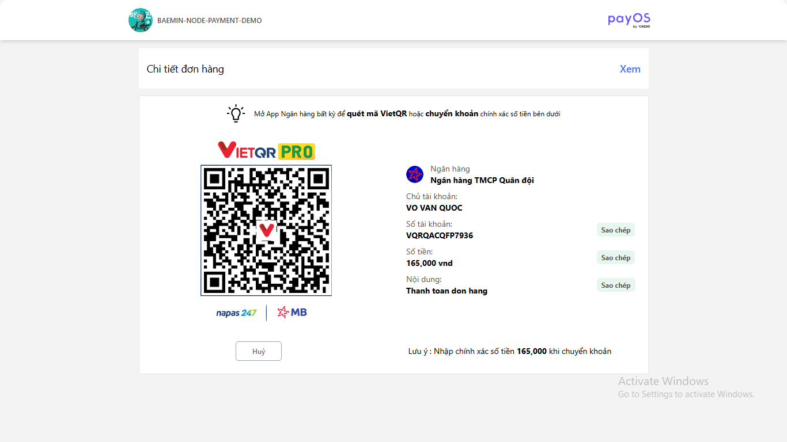
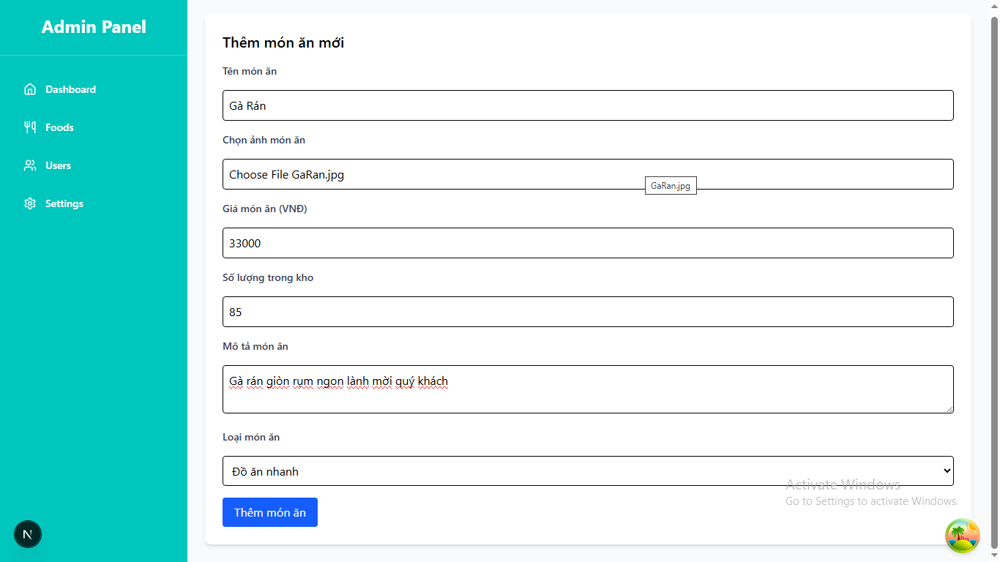
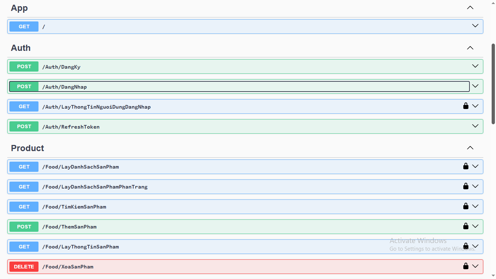
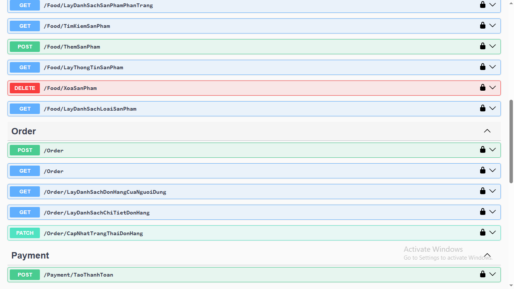

# 🍱 App Baemin - Food Delivery Web Clone

Một website đặt đồ ăn nhanh được lấy cảm hứng từ Baemin, tích hợp thanh toán qua **PayOS**. Dự án bao gồm cả **Frontend** (Next.js) và **Backend** (NestJS + MongoDB).

> 🚧 **Lưu ý:** Đây là dự án cá nhân để luyện tập và demo chức năng, chưa triển khai đầy đủ chức năng xác thực bảo mật & production-level optimization.

---

## 🚀 Features

- 🛍️ Danh sách sản phẩm và giỏ hàng
- 🔄 Thêm / sửa / xoá món ăn
- 💳 Tích hợp thanh toán trực tuyến với PayOS
- ✅ Giao diện đẹp, responsive
- 🔥 Toast thông báo người dùng
- 📦 Kiến trúc chia module rõ ràng (client/server)

---

## 📸 Screenshots

### 🏠 Home Page

### 🏠 Search Page

### 🏠 Login Page

### 🏠 SignUp Page

### 🏠 Food Page

### 🏠 Dashboard Page

### 🏠 Payment Page

### 🏠 AddFood Page

### 🏠 BE Demo Swagger

## 🧰 Tech Stack

### 💻 Frontend
- **Next.js** (React-based Framework)
- **Tailwind CSS**
- **React Hook Form**
- **Axios**
- **React Toastify**

### 🔧 Backend
- **NestJS** (Node.js Framework)
- **MySQL + Prisma**
- **Dotenv config**
- **PayOS API integration**

---

## 📁 Project Structure

---
## ⚙️ Getting Started

### 1. Clone repo
git clone https://github.com/Vanquoc0201/App_Baemin.git
cd App_Baemin

### 2. Run Source BE
start image docker
config db_baemin to db_baemin-export because it has data
cd BE_Baemin_app
npm install
npm run start:dev

### 3. Run source FE
cd FE_Baemin_App
npm install
npm run dev

